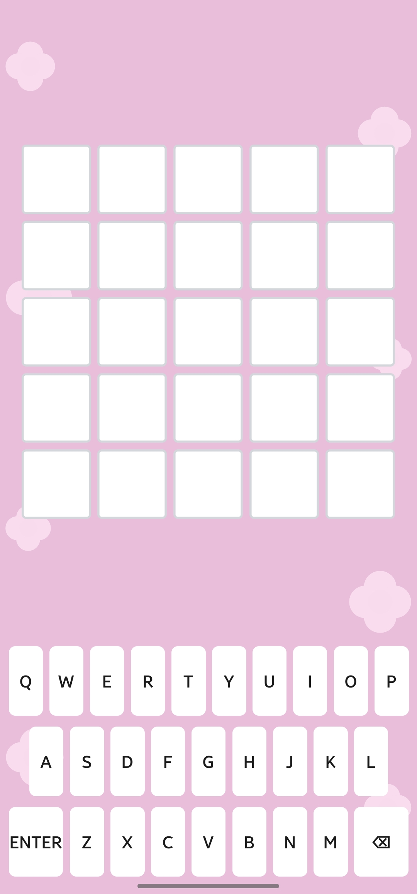

# Pink Wordle 🌸

A cozy, pastel-pink take on Wordle — built with [Expo](https://expo.dev). Guess the word (3 to 6 letters) in the same number of tries as its length, with a soft, minimal keyboard and board.

## Screenshots

<p align="center">
  
  
</p>

## Features

- Wordle gameplay with variable word length (3 to 6 letters), matching number of guesses
- Clean pink/pastel theme
- On-screen QWERTY keyboard
- Built and deployed with Expo

## Download

📲 **[Download the APK](https://github.com/145695/my_pink_wordle/releases/download/wordle/application-dd8e9615-555d-4bf4-b5c7-076892750fa2.apk)**

## Built With

- [Expo](https://expo.dev) / React Native

## Getting Started (for developers)

```bash
git clone https://github.com/YOUR_USERNAME/YOUR_REPO.git
cd YOUR_REPO
npm install
npx expo start
```

## License

MIT